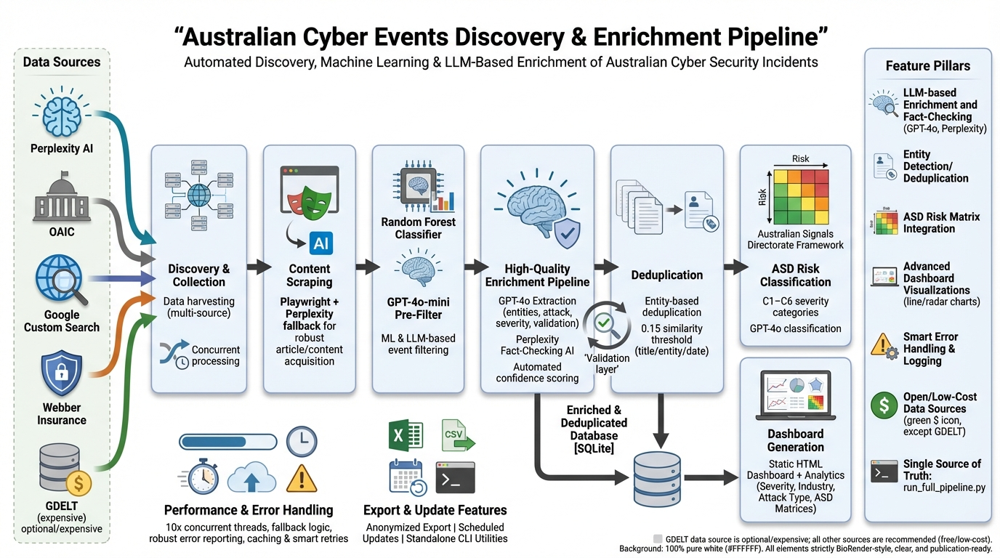

# Australian Cyber Events Discovery and Enrichment Pipeline

A comprehensive system for discovering, scraping, filtering, and enriching Australian cyber security events from multiple data sources using machine learning and LLM-based analysis.



## Overview

This pipeline automatically discovers cyber security incidents affecting Australian organizations by collecting data from multiple sources, scraping full content from URLs, and using both machine learning and LLM-based filtering to identify relevant events. The system creates a structured database of cyber events with detailed metadata, affected entities, and confidence scores.

## Key Features

- **Multi-Source Data Collection**: Perplexity AI, OAIC, Google Custom Search, Webber Insurance (GDELT available but expensive)
- **Unified Pipeline**: Single entry point (`run_full_pipeline.py`) for all operations
- **High-Quality Enrichment**: GPT-4o extraction + Perplexity AI fact-checking for validated data
- **ASD Risk Classification**: Australian Signals Directorate risk matrix framework integration
- **Intelligent Content Scraping**: Playwright-based scraping with enhanced Perplexity AI fallback
- **Machine Learning Filtering**: Random Forest classifier with runtime statistics tracking
- **Advanced LLM Analysis**: GPT-4o for primary extraction, GPT-4o-mini for initial filtering
- **Concurrent Processing**: 10-thread concurrent LLM processing for performance
- **Smart Deduplication**: Entity-based deduplication with 0.15 similarity threshold
- **Enhanced Error Handling**: Robust error recovery and detailed failure reporting
- **Comprehensive Logging**: Detailed processing logs and statistics
- **Database Management**: SQLite-based storage with backup and migration tools
- **Interactive Dashboards**: Static HTML dashboards with ASD risk matrices and analytics

## Data Sources

The pipeline supports 5 data sources. **Recommended sources** are low-cost or free:

### Recommended Sources (Low Cost)

| Source | Description | Cost | API Key Required |
|--------|-------------|------|------------------|
| **Perplexity AI** | AI-powered search that finds cyber incidents from across the web. Best for discovering historical events. | ~$0.005/query | Yes (`PERPLEXITY_API_KEY`) |
| **OAIC** | Official Australian breach notifications from the Office of the Australian Information Commissioner. | Free | No |
| **Google Custom Search** | Google search results for Australian cyber security news. | Free tier: 100 queries/day | Yes (`GOOGLE_CUSTOMSEARCH_API_KEY`, `GOOGLE_CUSTOMSEARCH_CX_KEY`) |
| **Webber Insurance** | Curated list of Australian data breaches from webberinsurance.com.au. High quality, Australia-focused. | Free (scraping) | No |

### Optional Source (Expensive)

| Source | Description | Cost | API Key Required |
|--------|-------------|------|------------------|
| **GDELT** | Global news event database via BigQuery. | **WARNING: Can cost hundreds to thousands of dollars** in BigQuery fees | Yes (Google Cloud Project + BigQuery) |

> **GDELT Cost Warning**: GDELT queries the public BigQuery dataset which charges per query based on data scanned. A single month of queries can easily cost $500-$2000+. **Do not use GDELT unless you have a BigQuery budget and understand the costs.** Use `--source Perplexity --source OAIC --source GoogleSearch --source WebberInsurance` to exclude GDELT.

## Architecture

```
+------------------+    +-------------------+    +------------------+
|   Data Sources   |--->|  Discovery &      |--->|  Content         |
|                  |    |  Collection       |    |  Scraping        |
| - Perplexity     |    |                   |    |                  |
| - OAIC           |    |                   |    |                  |
| - Google Search  |    |                   |    |                  |
| - Webber         |    |                   |    |                  |
| - GDELT ($$)     |    |                   |    |                  |
+------------------+    +-------------------+    +------------------+
                                                          |
+------------------+    +-------------------+    +------------------+
|   Enriched       |<---|  High-Quality     |<---|  ML Filtering    |
|   Database       |    |  Enrichment       |    |  (Random         |
|                  |    |  Pipeline         |    |   Forest)        |
| - GPT-4o Extract |    |                   |    |                  |
| - Perplexity     |    |  - GPT-4o         |    |                  |
|   Fact-Check     |    |  - Perplexity     |    |                  |
| - Validation     |    |  - Validation     |    |                  |
+------------------+    +-------------------+    +------------------+
         |
         v
+------------------+    +-------------------+    +------------------+
|   Deduplication  |--->|  ASD Risk         |--->|  Dashboard       |
|   (Entity-based) |    |  Classification   |    |  Generation      |
+------------------+    +-------------------+    +------------------+
```

### Pipeline Phases

The unified pipeline (`run_full_pipeline.py`) executes five main phases:

1. **Discovery & Initial Processing**: Discovers events from multiple sources, scrapes content, performs initial GPT-4o-mini filtering
2. **Perplexity AI Enrichment**: Automatically enriches all new events with Perplexity AI for formal entity names, threat actors, attack methods
3. **Global Deduplication**: Entity-based deduplication with 0.15 similarity threshold (same entity + same date or similar titles)
4. **ASD Risk Classification**: Classifies events using Australian Signals Directorate risk matrix (C1-C6 categories, incremental processing)
5. **Dashboard Generation**: Generates static HTML dashboard with embedded analytics and ASD risk matrices

## Project Structure

```
australian-cyber-events-scraper/
├── run_full_pipeline.py               # Unified pipeline script (SINGLE SOURCE OF TRUTH)
├── discover_enrich_events.py          # Legacy CLI wrapper (uses shared pipeline module)
├── build_static_dashboard.py          # Static HTML dashboard generator
├── rf_event_filter.py                 # Random Forest filter implementation
├── train_rf_filter.py                 # ML model training script
│
├── cyber_data_collector/pipelines/    # Shared pipeline implementations
│   └── discovery.py                   # Discovery/enrichment pipeline used by CLIs
│
├── # Standalone Utility Scripts
├── asd_risk_classifier.py             # ASD risk classification (standalone)
├── run_global_deduplication.py        # Global deduplication runner
├── oaic_data_scraper.py               # OAIC PDF report scraper
├── OAIC_dashboard_scraper.py          # OAIC Power BI dashboard scraper (Playwright + Vision API)
├── cleanup_oaic_data.py               # OAIC data validation and cleanup
├── export_events_excel.py             # Export events to Excel with LLM summaries
├── export_cyber_events.py             # Export deduplicated events to CSV/Excel with anonymization
├── perplexity_backfill_events.py      # Perplexity backfill for existing events
├── wipe_database.py                   # Database reset utility
├── database_migration_v2.py           # Database schema migration
│
├── cyber_data_collector/              # Core data collection framework
│   ├── datasources/                   # Data source implementations
│   │   ├── base.py                    # Base data source class
│   │   ├── gdelt.py                   # GDELT BigQuery integration
│   │   ├── perplexity.py              # Perplexity AI integration
│   │   ├── google_search.py           # Google Search API
│   │   ├── webber_insurance.py        # Webber Insurance scraper
│   │   └── oaic.py                    # OAIC data source
│   │
│   ├── enrichment/                    # High-quality enrichment pipeline
│   │   ├── high_quality_enrichment_pipeline.py  # Main enrichment orchestrator
│   │   ├── gpt4o_enricher.py          # GPT-4o extraction component
│   │   ├── perplexity_fact_checker.py # Perplexity fact-checking
│   │   ├── content_acquisition.py     # Content scraping/acquisition
│   │   ├── enrichment_validator.py    # Validation layer
│   │   └── enrichment_audit_storage.py # Audit trail storage
│   │
│   ├── filtering/                     # Event filtering components
│   │   ├── progressive_filter.py      # Progressive filtering logic
│   │   └── confidence_filter.py       # Confidence-based filtering
│   │
│   ├── processing/                    # Event processing components
│   │   ├── llm_classifier.py          # LLM-based classification
│   │   ├── entity_extractor.py        # Entity extraction
│   │   ├── deduplication.py           # Deduplication algorithms (v1)
│   │   ├── deduplication_v2.py        # Deduplication algorithms (v2)
│   │   ├── perplexity_enrichment.py   # Perplexity enrichment module
│   │   └── perplexity_enricher.py     # Alternative enricher
│   │
│   ├── storage/                       # Data storage components
│   │   ├── database.py                # Database operations
│   │   ├── deduplication_storage.py   # Deduplication storage
│   │   └── cache.py                   # Caching layer
│   │
│   ├── models/                        # Data models and schemas
│   │   ├── config.py                  # Configuration models
│   │   ├── events.py                  # Event data models
│   │   └── vulnerability_taxonomy.py  # Vulnerability classification
│   │
│   ├── utils/                         # Utility functions
│   │   ├── config_manager.py          # Configuration management
│   │   ├── rate_limiter.py            # API rate limiting
│   │   ├── pdf_extractor.py           # PDF content extraction
│   │   ├── validation.py              # Data validation
│   │   └── thread_manager.py          # Thread management
│   │
│   └── tests/                         # Test suite
│       ├── test_deduplication.py      # Deduplication tests
│       └── test_deduplication_v2.py   # V2 deduplication tests
│
├── machine_learning_filter/           # ML model files
│   ├── event_training_data.xlsx       # Training dataset
│   ├── event_training_data.csv        # Training dataset (CSV)
│   ├── random_forest_filter.pkl       # Trained model
│   ├── source_type_encoder.pkl        # Feature encoder
│   └── text_vectorizer.pkl            # Text vectorizer
│
├── instance/                          # Database files
│   └── cyber_events.db                # Main SQLite database
│
├── dashboard/                         # Generated dashboard files
│   └── index.html                     # Static HTML dashboard
│
├── risk_matrix/                       # Generated ASD risk matrices
│   ├── risk_matrix.xlsx               # Combined risk matrix
│   ├── risk_matrix_2020.xlsx          # Per-year matrices
│   ├── risk_matrix_2021.xlsx
│   ├── risk_matrix_2022.xlsx
│   ├── risk_matrix_2023.xlsx
│   ├── risk_matrix_2024.xlsx
│   └── risk_matrix_2025.xlsx
│
├── oaic_pdfs/                         # Downloaded OAIC PDF reports
├── oaic_screenshots/                  # OAIC dashboard screenshots (organized by session/semester)
│
├── documentation/                     # Setup and configuration docs
├── specifications/                    # Technical specifications
└── requirements.txt                   # Python dependencies
```

## Quick Start

### Prerequisites

- Python 3.8+
- OpenAI API key (for LLM analysis and enrichment)
- Perplexity AI API key (recommended, for event discovery and fact-checking)
- Google Custom Search API key (optional, for Google Search data source)
- Google Cloud account with BigQuery (optional, only if using GDELT - **expensive**)

### Installation

1. **Clone the repository**
   ```bash
   git clone <repository-url>
   cd australian-cyber-events-scraper
   ```

2. **Install dependencies**
   ```bash
   pip install -r requirements.txt
   ```

3. **Set up environment variables**
   ```bash
   cp .env.example .env
   # Edit .env with your API keys and configuration
   ```

4. **Run the unified pipeline** (uses recommended sources by default)
   ```bash
   # Recommended: Use low-cost sources only (excludes expensive GDELT)
   python run_full_pipeline.py --source Perplexity --source OAIC --source GoogleSearch --source WebberInsurance
   ```

5. **(Optional) Configure BigQuery for GDELT**

   > **Warning**: GDELT uses BigQuery which can cost hundreds to thousands of dollars.

   Only run this if you specifically want to use GDELT:
   ```bash
   python setup_bigquery_auth.py
   ```

6. **Run the unified pipeline**
   ```bash
   # Full pipeline (all phases: discovery, enrichment, deduplication, classification, dashboard)
   python run_full_pipeline.py

   # Discovery only (auto-enriches with Perplexity)
   python run_full_pipeline.py --discover-only

   # Dashboard only (if you already have data)
   python run_full_pipeline.py --dashboard-only
   ```

## Monthly Update Guide

This section explains how to run monthly updates to keep your cyber events database current, including discovering events that may have occurred more than a month ago but were only recently reported.

### Standard Monthly Update

Run the pipeline with recommended (low-cost) sources:

```bash
# Recommended: Use low-cost sources only
python run_full_pipeline.py --source Perplexity --source OAIC --source GoogleSearch --source WebberInsurance
```

This will:
1. Discover new events from Perplexity, OAIC, Google Search, and Webber Insurance
2. Automatically enrich them with Perplexity AI
3. Deduplicate against existing events
4. Classify with ASD risk matrix
5. Regenerate the dashboard

### Comprehensive Monthly Update (Recommended)

For a thorough monthly update that catches older events and events from multiple sources:

```bash
# Extended 30-day discovery with higher event limits (excludes expensive GDELT)
python run_full_pipeline.py --source Perplexity --source OAIC --source GoogleSearch --source WebberInsurance --days 30 --max-events 500
```

### Discovering Historical Events

Perplexity AI can discover events that occurred in the past but were only recently reported or that you may have missed. To specifically target historical event discovery:

```bash
# Use Perplexity source with extended date range
python run_full_pipeline.py --source Perplexity --days 60 --max-events 1000
```

**Note**: The `--days` parameter controls how far back to search for *news articles*, not event dates. Perplexity AI and other sources may return articles about events that occurred weeks or months earlier.

### Multi-Source Update Strategy

For the most comprehensive coverage using **recommended (low-cost) sources**:

```bash
# Step 1: Run Perplexity discovery (best for finding older events)
python run_full_pipeline.py --source Perplexity --days 30 --max-events 500 --discover-only

# Step 2: Run OAIC discovery (official breach notifications - free)
python run_full_pipeline.py --source OAIC --days 30 --max-events 200 --discover-only

# Step 3: Run Google Search discovery (100 free queries/day)
python run_full_pipeline.py --source GoogleSearch --days 14 --max-events 100 --discover-only

# Step 4: Run Webber Insurance discovery (free scraping)
python run_full_pipeline.py --source WebberInsurance --days 30 --max-events 200 --discover-only

# Step 5: Complete the pipeline (deduplication, classification, dashboard)
python run_full_pipeline.py --dashboard-only
```

Or run all recommended sources together:

```bash
python run_full_pipeline.py --source Perplexity --source OAIC --source GoogleSearch --source WebberInsurance --days 30 --max-events 500
```

### Backfilling Historical Data

If you need to backfill events that lack Perplexity enrichment:

```bash
# Re-enrich existing events with updated Perplexity prompts
python run_full_pipeline.py --re-enrich

# Limit re-enrichment to specific number of events
python run_full_pipeline.py --re-enrich --re-enrich-limit 100
```

### Full Monthly Update Checklist

1. **Pre-update backup** (automatic, but verify):
   ```bash
   # Backups are created in instance/ directory
   ls instance/*.backup.*
   ```

2. **Run comprehensive discovery** (using recommended low-cost sources):
   ```bash
   python run_full_pipeline.py --source Perplexity --source OAIC --source GoogleSearch --source WebberInsurance --days 30 --max-events 500
   ```

3. **Verify results**:
   - Check `unified_pipeline.log` for processing details
   - Open `dashboard/index.html` to review new events
   - Review `risk_matrix/risk_matrix_YYYY.xlsx` for current year classifications

4. **Optional: Run ASD classification for new events only**:
   ```bash
   python run_full_pipeline.py --classify-only
   ```

### Scheduled Monthly Updates

For automated monthly updates, create a scheduled task or cron job:

**Windows Task Scheduler**:
```bash
python d:\dev\australian-cyber-events-scraper\run_full_pipeline.py --source Perplexity --source OAIC --source GoogleSearch --source WebberInsurance --days 30 --max-events 500
```

**Linux/Mac Cron** (first Monday of each month at 2 AM):
```cron
0 2 1-7 * 1 cd /path/to/australian-cyber-events-scraper && python run_full_pipeline.py --source Perplexity --source OAIC --source GoogleSearch --source WebberInsurance --days 30 --max-events 500
```

## Configuration

### Environment Variables

Create a `.env` file with the following variables:

```env
# Required API Keys
OPENAI_API_KEY=your_openai_api_key              # Required for LLM enrichment

# Recommended API Keys (for data sources)
PERPLEXITY_API_KEY=your_perplexity_api_key      # Recommended - best for discovering events

# Optional API Keys (for additional data sources)
GOOGLE_CUSTOMSEARCH_API_KEY=your_google_api_key # Optional - for Google Search source
GOOGLE_CUSTOMSEARCH_CX_KEY=your_cx_key          # Optional - Google Custom Search Engine ID

# Optional: Google Cloud (ONLY needed for GDELT - WARNING: Expensive!)
# GOOGLE_CLOUD_PROJECT=your_project_id
# GOOGLE_APPLICATION_CREDENTIALS=path/to/service-account.json

# Database
DATABASE_URL=sqlite:///instance/cyber_events.db

# Processing
MAX_THREADS=10
BATCH_SIZE=20
```

**Note**: OAIC and Webber Insurance sources require no API keys (free scraping).

### Data Source Configuration

Each data source can be configured in the `cyber_data_collector/models/config.py` file:

```python
# Example configuration
gdelt_config = DataSourceConfig(
    name="GDELT",
    enabled=True,
    custom_config={
        "max_records": 1000,
        "date_range_days": 30
    }
)
```

## Usage

### Unified Pipeline (Recommended - Single Source of Truth)

The `run_full_pipeline.py` script is the **canonical entry point** for all operations. It combines discovery, enrichment, deduplication, ASD risk classification, and dashboard generation:

```bash
# Full pipeline (all phases: discovery, enrichment, deduplication, classification, dashboard)
python run_full_pipeline.py

# Discovery only (auto-enriches with Perplexity AI)
python run_full_pipeline.py --discover-only

# Re-enrich existing events with updated Perplexity prompts
python run_full_pipeline.py --re-enrich

# ASD Risk Classification only
python run_full_pipeline.py --classify-only

# Dashboard only (if you already have data)
python run_full_pipeline.py --dashboard-only

# Use specific sources with limits
python run_full_pipeline.py --source Perplexity --source OAIC --max-events 500

# Extended date range
python run_full_pipeline.py --days 14 --max-events 500

# Skip ASD classification (faster pipeline)
python run_full_pipeline.py --skip-classification

# Limit number of events to classify
python run_full_pipeline.py --classify-limit 50
```

### Standalone Scripts

#### ASD Risk Classifier

Classify events using the Australian Signals Directorate risk matrix:

```bash
# Classify all unclassified events
python asd_risk_classifier.py

# Limit classification to specific number
python asd_risk_classifier.py --limit 50

# Force reclassification of all events
python asd_risk_classifier.py --force-reclassify

# Custom output directory for risk matrices
python asd_risk_classifier.py --output-dir my_matrices
```

#### Global Deduplication

Run deduplication separately:

```bash
# Standard deduplication
python run_global_deduplication.py

# Dry run (preview without changes)
python run_global_deduplication.py --dry-run

# Custom database path
python run_global_deduplication.py --db-path path/to/db.sqlite
```

#### OAIC Breach Statistics Scraper

The OAIC (Office of the Australian Information Commissioner) publishes semi-annual Notifiable Data Breaches reports containing statistics on cyber incidents reported to the regulator. Use this scraper to update statistics when new reports are released.

**When to update**: OAIC typically releases reports twice per year:
- **H1 Report** (January-June): Published around August/September
- **H2 Report** (July-December): Published around February/March

**Basic usage** - scrape statistics from recent reports:
```bash
python oaic_data_scraper.py --start-year 2024 --end-year 2025 --output json
```

**Full historical scrape** (2018-present):
```bash
python oaic_data_scraper.py --start-year 2018 --output json
```

**Enhanced extraction with PDF parsing** (includes median/average affected individuals):
```bash
python oaic_data_scraper.py --start-year 2024 --end-year 2025 --output json --use-ai
```

**Available options**:
| Option | Description | Default |
|--------|-------------|---------|
| `--start-year YYYY` | First year to scrape | 2018 |
| `--end-year YYYY` | Last year to scrape | Current year |
| `--output FORMAT` | Output format: `json` or `csv` | json |
| `--use-ai` | Enable PDF parsing for additional statistics | False |

**Output files**: Results are saved to timestamped files:
- `oaic_cyber_statistics_YYYYMMDD_HHMMSS.json`
- `oaic_cyber_statistics_YYYYMMDD_HHMMSS.csv`

**Data extracted**:
- Total breach notifications
- Cyber incidents (count and percentage)
- Attack types: ransomware, phishing, hacking, brute force, malware, compromised credentials
- Top affected sectors
- Malicious attacks vs human error vs system faults
- (With `--use-ai`): Individuals affected distribution, median/average statistics

For more details, see [OAIC_SCRAPER_README.md](OAIC_SCRAPER_README.md).

#### OAIC Power BI Dashboard Scraper

The OAIC provides an interactive Power BI dashboard with detailed breach statistics. This scraper uses Playwright browser automation to navigate the dashboard and OpenAI's GPT-4o-mini Vision API to extract data from screenshots.

**When to use**: The Power BI dashboard contains more detailed breakdowns than the PDF reports, including:
- Time to identify breaches
- Time to notify OAIC
- Sector breakdowns with multiple filter views
- Historical semester comparisons

**Basic usage** - scrape all available semesters:
```bash
python OAIC_dashboard_scraper.py
```

**Scrape specific semester only**:
```bash
python OAIC_dashboard_scraper.py --semester "Jan-Jun 2025"
```

**Scrape 2025 onwards only**:
```bash
python OAIC_dashboard_scraper.py --from-2025
```

**Debug mode** (headful browser for troubleshooting):
```bash
python OAIC_dashboard_scraper.py --headful
```

**Available options**:
| Option | Description | Default |
|--------|-------------|---------|
| `--semester "X"` | Scrape specific semester (e.g., "Jan-Jun 2025") | All semesters |
| `--from-2025` | Only scrape 2025 and later | False |
| `--headful` | Show browser window for debugging | False (headless) |
| `--no-screenshots` | Skip saving screenshots (not recommended) | False |
| `--output FILE` | Custom output filename | `oaic_cyber_statistics_<timestamp>.json` |
| `--existing-data FILE` | Path to existing OAIC data to merge with | Auto-detect |
| `--debug` | Explore iframe elements and exit | False |

**How it works**:
1. Launches Playwright Chromium browser
2. Navigates to OAIC Power BI dashboard
3. Expands visualization to full screen
4. For each semester in dropdown:
   - Selects semester filter
   - Navigates through pages 2-9 (data pages)
   - Clicks filter options on pages with interactive filters (pages 6-9)
   - Captures screenshots of each view
5. Sends screenshots to GPT-4o-mini Vision API for OCR extraction
6. Consolidates extracted data into JSON format
7. Merges with existing PDF-scraped data (2025+ from dashboard, pre-2025 from PDF)

**Output files**:
- `oaic_cyber_statistics_<timestamp>.json` - Merged authoritative data
- `oaic_pdf_vs_dashboard_comparison_<timestamp>.json` - Validation comparison for historical periods
- `oaic_screenshots/<timestamp>/` - Timestamped screenshots organized by semester

**Screenshot storage structure**:
```
oaic_screenshots/
├── 2025-01-16_143022/           # Scrape session timestamp
│   ├── Jan_Jun_2025/
│   │   ├── page_2_Snapshot.png
│   │   ├── page_3_Notifications_received.png
│   │   ├── page_6_all_breaches.png
│   │   ├── page_6_cyber_incidents.png
│   │   └── ...
│   ├── Jul_Dec_2024/
│   │   └── ...
│   └── metadata.json            # Scrape session metadata
```

**Data merging strategy**:
- **2025+**: Uses dashboard-scraped data (more current)
- **Pre-2025**: Uses PDF-scraped data (authoritative historical record)
- **Comparison file**: Dashboard data for historical periods saved separately for validation

**Requirements**:
- OpenAI API key (`OPENAI_API_KEY` in `.env`)
- Playwright installed (`pip install playwright && playwright install chromium`)

**Cost estimate**: ~$0.05-0.10 per full scrape (8 pages × multiple semesters × GPT-4o-mini vision calls)

#### OAIC Data Cleanup

The OAIC data files may contain corrupted values from OCR extraction errors (e.g., sector counts of 10,000+ when total notifications is only 500). The cleanup script consolidates and validates all OAIC data sources.

**Run cleanup**:
```bash
python cleanup_oaic_data.py
```

**What it does**:
1. Uses clean historical data from `oaic_cyber_statistics_20251030_194752.json` as the base
2. Filters out quarterly periods (Q1, Q2) - keeps only half-yearly (H1, H2)
3. Merges `individuals_affected_average` and `individuals_affected_median` from PDF-scraped data
4. Adds 2025 H1 data from dashboard scraping (with `individuals_affected_distribution`)
5. Validates all records:
   - Removes sector entries where count > total_notifications
   - Nullifies attack type counts where value > total_notifications

**Output**: `oaic_cyber_statistics_cleaned_<timestamp>.json`

**When to run**:
- After scraping new OAIC data (PDF or dashboard)
- If you notice impossible values in dashboard charts (counts in thousands when totals are in hundreds)
- Before rebuilding the dashboard with `python build_static_dashboard.py`

**Data validation rules**:
| Field | Validation |
|-------|------------|
| `top_sectors[].notifications` | Must be ≤ total_notifications × 1.1 |
| `phishing`, `ransomware`, etc. | Must be ≤ total_notifications × 1.1 |
| `period` | Must be "H1" or "H2" (quarterly data filtered out) |

#### Export Events to Excel

Export all deduplicated cyber events to an Excel file with LLM-summarized descriptions and fully anonymized versions.

> **Note**: This script (`export_events_excel.py`) produces a clean 7-column Excel file suitable for sharing. For a full database export with all columns, use `export_cyber_events.py` instead.

**Basic usage**:
```bash
python export_events_excel.py
```

**Output columns**:
| Column | Description |
|--------|-------------|
| Event Date | Date of the cyber incident |
| Event Title | Title/headline of the event |
| Event Description | LLM-summarized comprehensive description |
| Anonymised Description | Fully anonymized description with entity names replaced, dates/years removed, and title removed |
| Records Affected | Number of customer/user records compromised |
| Entity Type | Industry category of the victim organization ("Unknown" if not available) |
| Attack Type | Type of cyber attack ("Unknown" if not available) |

**Available options**:
| Option | Description | Default |
|--------|-------------|---------|
| `--output FILE` | Custom output filename | `cyber_events_export_<timestamp>.xlsx` |
| `--limit N` | Export only first N events | All events |
| `--no-llm` | Skip LLM summarization (faster, uses raw text) | False |
| `--max-words N` | Maximum words for description | 500 |
| `--db-path PATH` | Path to SQLite database | `instance/cyber_events.db` |
| `--exclude-unknown-records` | Exclude events where records_affected is unknown | False |
| `--workers N` | Number of parallel workers for LLM processing | 10 |

**Examples**:
```bash
# Export all events with LLM summaries and anonymization
python export_events_excel.py

# Exclude events where records affected is unknown
python export_events_excel.py --exclude-unknown-records

# Quick export without LLM (faster, but no anonymization)
python export_events_excel.py --no-llm

# Export first 100 events to custom file
python export_events_excel.py --limit 100 --output recent_events.xlsx

# Export with shorter summaries (200 words max)
python export_events_excel.py --max-words 200
```

**Anonymization features** (Anonymised Description column):
- Replaces ALL organization names with generic industry descriptions (e.g., "Medibank" → "a major health insurer")
- Replaces ALL person names with generic roles (e.g., "John Smith, CEO" → "the CEO")
- Replaces ALL threat actor/hacker group names with "threat actors" or "attackers"
- Removes ALL dates and years (specific dates, months with years, quarters, standalone years)
- Removes title text from the beginning of descriptions
- Uses all known entity names from the database to ensure thorough anonymization

**Category normalization**:
- Entity Type shows "Unknown" when industry is null/empty
- Attack Type shows "Unknown" when event type is null/empty

**How it works**:
1. Reads all active deduplicated events from the database
2. Loads all known entity names from the database for thorough anonymization
3. For each event, collects text from:
   - DeduplicatedEvents (title, description, summary)
   - EnrichedEvents (linked event descriptions)
   - RawEvents (original scraped content, limited to 10000 chars per source)
4. Sends combined text to GPT-4o-mini for summarization
5. Creates fully anonymized version (removes entity names, dates, years, and titles)
6. Exports to Excel with text wrapping and appropriate row heights for readability

**Requirements**:
- OpenAI API key (`OPENAI_API_KEY` in `.env`) - required for LLM summarization and anonymization
- openpyxl (`pip install openpyxl`)

**Cost estimate**: ~$0.02-0.10 per 100 events (2 LLM calls per event: summarization + anonymization)

#### Export Cyber Events Database

Export deduplicated events from the database to CSV or Excel format with support for filtering, anonymization, and data normalization.

> **Note**: This script (`export_cyber_events.py`) exports all database columns. For a clean 7-column Excel file with LLM summaries suitable for sharing, use `export_events_excel.py` instead.

**Basic usage**:
```bash
# Export all deduplicated events to CSV
python export_cyber_events.py --format csv --output events.csv

# Export to Excel with entity and source details
python export_cyber_events.py --format excel --output events.xlsx --detailed
```

**Anonymization and filtering options**:
```bash
# Export with anonymized descriptions (removes entity names, dates, years, and titles)
python export_cyber_events.py --format csv --output anon_events.csv --detailed --anonymize

# Exclude events where records affected is unknown
python export_cyber_events.py --format csv --output known_records.csv --detailed --exclude-unknown-records

# Combine both options for clean, anonymized export
python export_cyber_events.py --format csv --output clean_export.csv --detailed --anonymize --exclude-unknown-records
```

**Available options**:
| Option | Description | Default |
|--------|-------------|---------|
| `--format FORMAT` | Export format: `csv`, `excel`, or `both` | csv |
| `--output FILE` | Output file path (omit extension for `both`) | Required |
| `--table TABLE` | Table to export | DeduplicatedEvents |
| `--date-range RANGE` | Filter by date range (format: `YYYY-MM-DD,YYYY-MM-DD`) | All dates |
| `--detailed` | Include entity and source details (JSON) | False |
| `--no-entities` | Exclude entity information from detailed export | False |
| `--no-sources` | Exclude source information from detailed export | False |
| `--exclude-unknown-records` | Exclude events where records_affected is unknown/null | False |
| `--anonymize` | Anonymize descriptions by removing entity names, dates, and titles | False |
| `--list-tables` | List available tables and exit | - |
| `--summary` | Show database summary and exit | - |

**Anonymization features** (when `--anonymize` is enabled):
- Replaces victim organization names with `[Victim Organization]` or `[Victim Organization - Industry]`
- Replaces threat actor names with `[Threat Actor]`
- Replaces all other known entity names with `[Organization]`
- Removes dates in various formats (2024-01-15, January 15 2024, Jan 2024, Q1 2024, etc.)
- Removes standalone years (1990-2099)
- Removes relative time expressions ("in 2024", "during 2024", etc.)
- Removes title text from the beginning of descriptions
- Handles entity name variations (with/without suffixes like Pty Ltd, Inc, etc.)

**Category normalization**:
- Entity types that are null/unknown/empty display as "Unknown"
- Attack methods that are null/unknown/empty display as "Unknown"

**Examples**:
```bash
# Show database summary
python export_cyber_events.py --summary

# Export events from 2024
python export_cyber_events.py --format excel --output events_2024.xlsx --detailed --date-range 2024-01-01,2024-12-31

# Export both CSV and Excel formats
python export_cyber_events.py --format both --output cyber_events --detailed

# Export anonymized data for external sharing
python export_cyber_events.py --format csv --output share_events.csv --detailed --anonymize --exclude-unknown-records
```

#### Perplexity Backfill

Backfill existing events with Perplexity enrichment:

```bash
python perplexity_backfill_events.py
```

### Legacy Pipeline Script (Deprecated)

> **Note**: The original `discover_enrich_events.py` script is deprecated. Use `run_full_pipeline.py` instead for consistent Perplexity AI enrichment, advanced deduplication, and ASD risk classification.

The legacy script may still work but lacks recent improvements:
```bash
# Full pipeline (discover, scrape, enrich)
python discover_enrich_events.py --discover --enrich

# Discovery only
python discover_enrich_events.py --discover --max-events 500

# Enrichment only (for existing raw events)
python discover_enrich_events.py --enrich
```

### Dashboard Generation

Generate interactive dashboards with enhanced visualizations:

```bash
# Static HTML dashboard
python build_static_dashboard.py

# Flask dashboard server
python generate_dashboard.py --launch-server

# Custom output directory
python build_static_dashboard.py --out-dir my_dashboard
```

### Command Line Options

#### Unified Pipeline Options

| Option | Description | Default |
|--------|-------------|---------|
| `--discover-only` | Run only discovery phase | False |
| `--dashboard-only` | Run only dashboard generation | False |
| `--classify-only` | Run only ASD risk classification | False |
| `--re-enrich` | Re-enrich existing events with updated prompts | False |
| `--re-enrich-limit N` | Limit number of events to re-enrich | No limit |
| `--skip-classification` | Skip ASD risk classification phase | False |
| `--classify-limit N` | Limit number of events to classify | No limit |
| `--continue-on-error` | Continue to next phase if previous fails | False |
| `--source SOURCE` | Data sources to use (can specify multiple) | All |
| `--max-events N` | Maximum events per source per month | 1000 |
| `--days N` | Number of days to look back | 7 |
| `--out-dir DIR` | Output directory for static dashboard | dashboard |
| `--db-path PATH` | Database file path | instance/cyber_events.db |

#### ASD Risk Classifier Options

| Option | Description | Default |
|--------|-------------|---------|
| `--limit N` | Limit number of events to classify | No limit |
| `--force-reclassify` | Re-classify already classified events | False |
| `--output-dir DIR` | Output directory for risk matrices | risk_matrix |
| `--db-path PATH` | Database file path | instance/cyber_events.db |

#### Global Deduplication Options

| Option | Description | Default |
|--------|-------------|---------|
| `--db-path PATH` | Database file path | instance/cyber_events.db |
| `--backup-path PATH` | Backup file path | Auto-generated |
| `--dry-run` | Preview changes without applying | False |

### Enhanced Dashboard Features

The dashboard now includes advanced visualizations for deeper insights:

#### New Visualizations

1. **Maximum Severity Per Month**
   - Line chart showing the highest severity event each month
   - Interactive tooltips with entity name and severity details
   - Helps identify the worst incidents over time

2. **Severity by Industry Radar Chart**
   - Radar/spider chart comparing average severity across industries
   - Shows which industries face the most severe attacks
   - Interactive hover effects for detailed information

3. **Severity by Attack Type Radar Chart**
   - Radar chart comparing average severity across attack types
   - Identifies which attack types are most severe
   - Color-coded for easy interpretation

4. **Enhanced Severity Analysis**
   - Median severity calculations for better distribution understanding
   - Numeric severity mapping (Critical=4, High=3, Medium=2, Low=1)
   - Consistent severity scoring across all visualizations

#### Static Dashboard

The pipeline generates a self-contained HTML dashboard with embedded data and interactive Chart.js visualizations. Open `dashboard/index.html` in any modern web browser.

### Training ML Models

Train the Random Forest filter with labeled data:

```bash
python train_rf_filter.py
```

This will:
- Load training data from `machine_learning_filter/event_training_data.xlsx`
- Train a Random Forest classifier
- Save the model and preprocessing components
- Generate performance metrics

## Database Schema

The system uses SQLite with the following tables:

### Core Tables

#### RawEvents
Stores discovered events before processing:
| Column | Type | Description |
|--------|------|-------------|
| `raw_event_id` | TEXT | Primary key |
| `source_type` | VARCHAR(50) | GDELT, Perplexity, GoogleSearch, WebberInsurance, OAIC |
| `source_event_id` | TEXT | External ID from source |
| `raw_title` | TEXT | Original title |
| `raw_description` | TEXT | Original description |
| `raw_content` | TEXT | Full scraped content |
| `event_date` | DATE | Event occurrence date |
| `source_url` | VARCHAR(2048) | Source URL |
| `source_metadata` | TEXT | JSON metadata |
| `discovered_at` | TIMESTAMP | Discovery timestamp |
| `is_processed` | BOOLEAN | Processing status |

#### EnrichedEvents
Stores processed and classified events:
| Column | Type | Description |
|--------|------|-------------|
| `enriched_event_id` | TEXT | Primary key |
| `raw_event_id` | TEXT | Foreign key to RawEvents |
| `title` | TEXT | Enriched title |
| `description` | TEXT | Enriched description |
| `summary` | TEXT | LLM-generated summary |
| `event_type` | VARCHAR(50) | Attack type classification |
| `severity` | VARCHAR(20) | Critical/High/Medium/Low |
| `event_date` | DATE | Event date |
| `records_affected` | BIGINT | Number of records affected |
| `is_australian_event` | BOOLEAN | Australian relevance |
| `is_specific_event` | BOOLEAN | Specific vs general event |
| `confidence_score` | REAL | Overall confidence (0-1) |

#### DeduplicatedEvents
Final unique events after deduplication:
| Column | Type | Description |
|--------|------|-------------|
| `deduplicated_event_id` | TEXT | Primary key |
| `master_enriched_event_id` | TEXT | Best enriched event reference |
| `title` | VARCHAR(255) | Final title |
| `description` | TEXT | Final description |
| `summary` | TEXT | Final summary |
| `event_type` | VARCHAR(50) | Attack type |
| `severity` | VARCHAR(20) | Severity level |
| `event_date` | DATE | Event date |
| `records_affected` | BIGINT | Records affected |
| `total_data_sources` | INTEGER | Contributing sources count |
| `contributing_raw_events` | INTEGER | Raw events merged |
| `similarity_score` | REAL | Average similarity of merged events |
| `status` | VARCHAR(20) | Active/Inactive |

#### ASDRiskClassifications
ASD risk matrix classifications:
| Column | Type | Description |
|--------|------|-------------|
| `classification_id` | TEXT | Primary key |
| `deduplicated_event_id` | TEXT | Foreign key to DeduplicatedEvents |
| `severity_category` | VARCHAR(2) | C1-C6 category |
| `primary_stakeholder_category` | VARCHAR(255) | Stakeholder level |
| `impact_type` | VARCHAR(100) | Impact classification |
| `reasoning_json` | TEXT | Classification reasoning |
| `confidence_score` | REAL | Classification confidence |
| `model_used` | VARCHAR(50) | GPT model used |

### Supporting Tables

#### EntitiesV2
Organization and entity information:
| Column | Type | Description |
|--------|------|-------------|
| `entity_id` | INTEGER | Primary key |
| `entity_name` | VARCHAR(255) | Organization name |
| `entity_type` | VARCHAR(50) | Entity classification |
| `industry` | VARCHAR(100) | Industry sector |
| `is_australian` | BOOLEAN | Australian organization |

#### ProcessingLog
Tracks processing attempts and results:
| Column | Type | Description |
|--------|------|-------------|
| `log_id` | TEXT | Primary key |
| `raw_event_id` | TEXT | Foreign key |
| `processing_stage` | VARCHAR(50) | url_scraping, llm_analysis, etc. |
| `status` | VARCHAR(20) | success, failed, skipped |
| `error_message` | TEXT | Error details if failed |

#### EnrichmentAuditTrail
Comprehensive audit trail for enrichment pipeline (36 columns tracking all enrichment stages, content acquisition, GPT-4o extraction, Perplexity fact-checking, validation outcomes).

## Machine Learning Components

### Random Forest Filter

The system uses a trained Random Forest classifier to filter out non-cyber events:

**Features:**
- Source type (categorical)
- Combined text features (title + description + content + processed URL)
- TF-IDF vectorization with 1000 features
- Bigram support for better context

**Training Data:**
- 115 labeled events
- Binary classification (keep/filter)
- Cross-validation F1 score: 0.763

**Performance:**
- Test accuracy: 87.0%
- Handles class imbalance with balanced weights
- Word boundary matching to avoid false positives

**Runtime Statistics:**
- Tracks events processed, kept, and filtered per run
- Provides detailed filtering statistics
- Resets statistics for each pipeline run
- Clear reporting of current run performance

### High-Quality Enrichment Pipeline

The system uses a multi-stage enrichment process for maximum accuracy:

**Stage 1: Content Acquisition**
- Multi-tier extraction (newspaper3k, trafilatura, BeautifulSoup)
- Full article text extraction (not just title/summary)
- Robust fallback mechanisms

**Stage 2: GPT-4o Primary Extraction**
- Ultra-specific prompts with examples
- Event validation (cyber vs non-cyber)
- Australian relevance assessment
- Event type classification
- Severity assessment
- Entity extraction (victim organizations, threat actors)
- Technical detail extraction
- Improved specificity classification (distinguishes specific incidents from general advice)

**Stage 3: Perplexity AI Fact-Checking**
- Cross-validates extracted facts with real-time search
- Verifies entity names, dates, attack types
- Multi-source verification for confidence scoring
- Handles formal entity name resolution

**Stage 4: Validation Layer**
- Sensibility checks for names, dates, consistency
- Specificity override rules (catches GPT-4o mistakes)
- Geographic validation
- Confidence aggregation with penalty system (AUTO_ACCEPT/ACCEPT_WITH_WARNING/REJECT)

**Concurrent Processing:**
- 10 concurrent threads for LLM operations
- Semaphore-based rate limiting
- Error handling and retry logic

**Initial Filtering:**
- GPT-4o-mini for fast, basic quality check during discovery
- Random Forest classifier for pre-filtering

## Performance Optimizations

### Concurrent Processing
- **LLM Classification**: 10 concurrent threads with semaphore limiting
- **Entity Extraction**: 10 concurrent threads with semaphore limiting
- **URL Scraping**: Async/await with Playwright and enhanced fallback
- **Database Operations**: Thread-safe with locks and transaction management

### Enhanced Scraping
- **Perplexity AI Fallback**: Automatic fallback for failed or short content
- **Content Length Validation**: Triggers fallback for content < 50 characters
- **Alternative URL Discovery**: Finds working URLs for broken/inaccessible links
- **Smart Retry Logic**: Handles timeouts, 403/404 errors, and content issues

### Smart Deduplication
- **Entity-Based Matching**: Uses formal entity names for accurate duplicate detection
- **Rule 1**: Same entity + same date -> merge
- **Rule 2**: Same entity + similar titles (0.15 similarity threshold) -> merge
- **Earliest Date**: Uses earliest event date for merged events
- **Single Event Definition**: One real-world incident = One event (not multiple news articles)
- **Cross-Month Intelligence**: Processes events from last 3 months of actual event dates
- **30-Day Tolerance**: Events within 30 days can be considered duplicates
- **Automatic Skip Logic**: Skips when all events are from same month

### Caching and Rate Limiting
- **API Rate Limiting**: Prevents API quota exhaustion
- **Content Caching**: Avoids re-scraping same URLs
- **Database Indexing**: Optimized queries for large datasets

### Memory Management
- **Batch Processing**: Processes events in configurable batches
- **Streaming**: Handles large datasets without memory issues
- **Connection Pooling**: Efficient database connections

## Monitoring and Logging

### Logging Levels
- **INFO**: Pipeline progress and statistics
- **DEBUG**: Detailed processing information
- **WARNING**: Non-critical issues
- **ERROR**: Processing failures

### Statistics Tracking
- Events discovered per source
- Scraping success rates with Perplexity fallback tracking
- Random Forest filtering statistics (runtime only)
- LLM processing metrics
- Cross-month deduplication statistics
- Database operation counts

### Progress Indicators
- Real-time progress bars for long operations
- Batch processing indicators
- Success/failure counts
- Performance metrics

## Development and Testing

### Running Tests
```bash
# Run all tests
pytest

# Run specific test modules
pytest cyber_data_collector/tests/

# Run with coverage
pytest --cov=cyber_data_collector
```

### Database Management
```bash
# Backup database
cp instance/cyber_events.db instance/cyber_events_backup_$(date +%Y%m%d_%H%M%S).db

# Reset database
python wipe_database.py

# Migrate schema
python database_migration_v2.py

# Add deduplication schema
python add_deduplication_schema.py

# Add ASD risk schema
python add_asd_risk_schema.py
```

### Debugging Tools
```bash
# Test specific data sources
python test_gdelt_only.py
python test_perplexity_only.py

# Debug LLM extraction
python debug_llm_extractor.py

# Test Random Forest filter
python debug_rf_filter.py
```

## Documentation

### Setup & Configuration
- **[OAIC Scraper](OAIC_SCRAPER_README.md)**: OAIC data source documentation (free)
- **[Machine Learning Filter](documentation/machine_learning_filter_specifications.md)**: ML filter specifications
- **[LLM Optimization](documentation/llm_optimisation.md)**: LLM optimization guide
- **[BigQuery Setup](documentation/bigquery_setup.md)**: Google Cloud configuration (for GDELT - **expensive**)

### Technical Specifications
- **[Data Sources](specifications/all_cyber_data_sources.md)**: Detailed source specifications
- **[Storage Schema](specifications/data_storage_specifications.md)**: Database design
- **[GDELT Integration](specifications/gdelt_data_source.md)**: GDELT-specific documentation
- **[Perplexity Integration](specifications/perplexity_data_source.md)**: Perplexity configuration
- **[Dashboard Specifications](specifications/dashboard_specifications.md)**: Dashboard design

### Architecture & Implementation
- **[Pipeline Architecture](PIPELINE_ARCHITECTURE.md)**: System architecture overview
- **[Enrichment Pipeline](ENRICHMENT_PIPELINE_IMPLEMENTATION_COMPLETE.md)**: High-quality enrichment implementation
- **[ASD Risk Classifier](ASD_RISK_CLASSIFIER_INTEGRATION.md)**: ASD risk classification integration
- **[Deduplication Analysis](DEDUPLICATION_ANALYSIS.md)**: Deduplication strategy details
- **[Improved Deduplication Guide](IMPROVED_DEDUPLICATION_GUIDE.md)**: Advanced deduplication guide

### Phase Completion Reports
- **[Phase 1 Summary](PHASE1_COMPLETION_SUMMARY.md)**: Phase 1 completion report
- **[Phase 2 Summary](PHASE2_COMPLETION_SUMMARY.md)**: Phase 2 completion report
- **[Phase 3 Summary](PHASE3_COMPLETION_SUMMARY.md)**: Phase 3 completion report
- **[Implementation Summary](IMPLEMENTATION_SUMMARY.md)**: Overall implementation summary
- **[Final Integration Summary](FINAL_INTEGRATION_SUMMARY.md)**: Final integration details

### Database Documentation
- **[V2 Schema](README_v2_schema.md)**: Version 2 database schema
- **[Database Wipe](README_wipe_database.md)**: Database reset documentation

## Contributing

1. Fork the repository
2. Create a feature branch
3. Make your changes
4. Add tests for new functionality
5. Ensure all tests pass
6. Submit a pull request

### Code Style
- Follow PEP 8 guidelines
- Use type hints
- Add docstrings for functions and classes
- Include error handling
- Write comprehensive tests

## License

This project is licensed under the MIT License - see the LICENSE file for details.

## Troubleshooting

### Common Issues

**BigQuery Authentication Errors**
```bash
# Re-authenticate
python setup_bigquery_auth.py
# or
gcloud auth application-default login
```

**LLM API Rate Limits**
- Check your OpenAI API usage
- Reduce concurrent threads if needed
- Implement exponential backoff

**Database Lock Errors**
- Ensure only one pipeline instance runs at a time
- Check for zombie processes
- Restart if necessary

**Memory Issues**
- Reduce batch size in configuration
- Process smaller date ranges
- Monitor system resources

**Scraping Failures**
- Check Perplexity API key configuration
- Verify network connectivity
- Review scraping logs for specific error patterns
- Ensure Playwright dependencies are installed

**Cross-Month Deduplication Issues**
- Verify events span multiple months (not just same day)
- Check event_date field accuracy
- Review deduplication tolerance settings (30 days)

### Getting Help

1. Check the logs in `unified_pipeline.log` or `discover_enrich_events.log`
2. Review the troubleshooting section in documentation
3. Check GitHub issues for similar problems
4. Create a new issue with detailed error information

## Recent Improvements

### Unified Pipeline Script (Single Source of Truth)
- **Canonical Entry Point**: `run_full_pipeline.py` is the main entry point for all operations
- **Five-Phase Pipeline**: Discovery -> Perplexity Enrichment -> Deduplication -> ASD Classification -> Dashboard
- **Flexible Execution**: Run individual phases or full pipeline
- **Enhanced CLI**: Comprehensive command-line options for all operations
- **Error Handling**: Continue-on-error option for robust pipeline execution
- **Incremental Processing**: ASD classification only processes unclassified events

### High-Quality Enrichment Pipeline
- **GPT-4o Primary Extraction**: Ultra-specific prompts with examples for accurate extraction
- **Perplexity AI Fact-Checking**: Multi-source verification of extracted facts
- **Validation Layer**: Sensibility checks and specificity override rules
- **Improved Specificity Classification**: Distinguishes specific incidents from general advice/analysis
- **Confidence Aggregation**: Weighted decision logic with penalty system (AUTO_ACCEPT/ACCEPT_WITH_WARNING/REJECT)
- **Full Article Text**: Uses complete article content, not just title/summary
- **Zero Regex**: No brittle pattern matching - all LLM-based

### ASD Risk Classification Integration
- **Australian Signals Directorate Framework**: C1-C6 severity categories
- **Stakeholder Level Classification**: Intelligent classification based on impact and records affected
- **Incremental Processing**: Only classifies events without existing classifications
- **Dashboard Integration**: Risk matrices included in generated dashboards (all years + current year)
- **GPT-4o Based**: Uses GPT-4o for intelligent classification

### Enhanced Dashboard Visualizations
- **Maximum Severity Per Month**: Line chart with entity details on hover
- **Severity by Industry Radar**: Interactive radar chart comparing industry severity
- **Severity by Attack Type Radar**: Radar chart showing attack type severity patterns
- **ASD Risk Matrices**: All years + current year risk matrix visualizations
- **Enhanced Severity Analysis**: Median severity calculations and numeric mapping
- **Interactive Tooltips**: Rich hover information with entity names and severity details

### Enhanced Perplexity AI Integration
- **Automatic Enrichment**: All new events automatically enriched with Perplexity AI after discovery
- **Formal Entity Names**: Extracts official organization names
- **Threat Actor Identification**: Identifies threat actors and attack methods
- **Content Length Fallback**: Automatically triggers Perplexity when content is too short (< 50 chars)
- **Alternative URL Discovery**: Finds working URLs for broken or inaccessible links
- **Improved Success Tracking**: Detailed reporting of Perplexity fallback attempts and success rates

### Smart Deduplication System
- **Entity-Based Matching**: Uses formal entity names for accurate duplicate detection
- **Similarity Threshold**: 0.15 threshold for title similarity with same entity
- **Cross-Month Intelligence**: Processes events from last 3 months of actual event dates
- **30-Day Tolerance**: Extended from 7 days to 30 days for better duplicate detection
- **Automatic Skip Logic**: Skips cross-month deduplication when all events are from same month
- **Single Event Definition**: One real-world incident = One event (not multiple news articles)

### Random Forest Filter Enhancements
- **Runtime Statistics**: Tracks filtering performance per pipeline run
- **Clear Reporting**: Shows current run statistics, not cumulative totals
- **Statistics Reset**: Clean slate for each pipeline execution

### Robust Error Handling
- **Enhanced Scraping**: Better handling of timeouts, HTTP errors, and content issues
- **Database Transaction Management**: Improved transaction handling and error recovery
- **Detailed Failure Reporting**: Comprehensive logging of scraping failures and fallback attempts
- **Audit Trail**: Complete enrichment audit trail stored in database

## Future Enhancements

- **Additional Data Sources**: More cyber security feeds
- **Advanced ML Models**: Deep learning for better classification
- **Real-time Processing**: Stream processing capabilities
- **Enhanced Dashboard Features**: More interactive visualizations and filtering
- **API Endpoints**: REST API for external integrations
- **Cloud Deployment**: Docker and Kubernetes support
- **Enhanced Fallback Systems**: Multiple fallback strategies for failed scrapes
- **Advanced Deduplication**: ML-based similarity detection
- **Performance Analytics**: Detailed performance metrics and optimization suggestions
- **Dashboard Export**: PDF/PNG export of dashboard visualizations
- **Real-time Updates**: Live dashboard updates as new events are discovered

---

**Built for Australian cyber security research and monitoring.**
