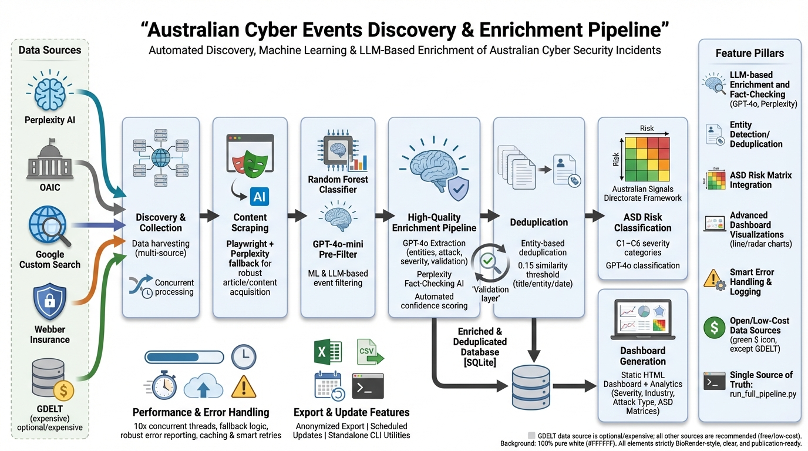

# Australian Cyber Events Discovery and Enrichment Pipeline

A Python pipeline for discovering, scraping, filtering, and enriching Australian cyber security events from multiple data sources using machine learning and LLM-based analysis.



---

## Quick Start — 3 Commands

All scripts must be run from the **project root directory**.

```bash
# Check status (last ingest + latest event in database)
python pipeline.py status

# Rolling 90-day refresh — recommended for monthly updates
python pipeline.py refresh

# Full pipeline with advanced options
python run_full_pipeline.py [options]
```

That's it for day-to-day use. Everything else is optional.

---

## Installation

```bash
git clone https://github.com/colinpriest/australian-cyber-events-scraper.git
cd australian-cyber-events-scraper

pip install -r requirements.txt

# For OAIC Power BI dashboard scraping (optional):
playwright install chromium

# Configure API keys
cp .env.example .env
# Edit .env with your keys
```

---

## Environment Variables

Create a `.env` file:

```env
# Required
OPENAI_API_KEY=your_openai_api_key

# Recommended (for event discovery)
PERPLEXITY_API_KEY=your_perplexity_api_key

# Optional (for Google Search source)
GOOGLE_CUSTOMSEARCH_API_KEY=your_google_api_key
GOOGLE_CUSTOMSEARCH_CX_KEY=your_cx_key

# Optional (GDELT only — WARNING: expensive BigQuery fees)
# GOOGLE_CLOUD_PROJECT=your_project_id
# GOOGLE_APPLICATION_CREDENTIALS=path/to/service-account.json

# Database
DATABASE_URL=sqlite:///instance/cyber_events.db

# Processing
MAX_THREADS=10
BATCH_SIZE=20
```

---

## pipeline.py — Simplified CLI

```bash
python pipeline.py refresh          # Rolling 90-day refresh (recommended)
python pipeline.py status           # Show last ingest and latest event
python pipeline.py rebuild --force  # Wipe and fully rebuild (destructive)
```

---

## run_full_pipeline.py — Advanced Control

The unified 5-phase pipeline: Discovery → Perplexity Enrichment → Deduplication → ASD Classification → Dashboard.

```bash
# Full pipeline (all phases)
python run_full_pipeline.py

# Discovery only (auto-enriches with Perplexity)
python run_full_pipeline.py --discover-only

# Re-enrich existing events
python run_full_pipeline.py --re-enrich [--re-enrich-limit N]

# ASD Risk Classification only
python run_full_pipeline.py --classify-only [--classify-limit N]

# Dashboard only (data already collected)
python run_full_pipeline.py --dashboard-only

# Specific sources, limits, date window
python run_full_pipeline.py --source Perplexity OAIC GoogleSearch WebberInsurance --days 30 --max-events 500

# Skip classification (faster)
python run_full_pipeline.py --skip-classification
```

### Options

| Option | Description | Default |
|--------|-------------|---------|
| `--discover-only` | Discovery phase only | False |
| `--dashboard-only` | Dashboard generation only | False |
| `--classify-only` | ASD classification only | False |
| `--re-enrich` | Re-enrich existing events | False |
| `--re-enrich-limit N` | Limit re-enrichment count | No limit |
| `--skip-classification` | Skip ASD classification | False |
| `--classify-limit N` | Limit classification count | No limit |
| `--continue-on-error` | Continue if a phase fails | False |
| `--source SOURCE [SOURCE ...]` | Data sources to use | All |
| `--max-events N` | Max events per source per month | 1000 |
| `--days N` | Lookback window in days (0 = full history) | 0 |
| `--out-dir DIR` | Dashboard output directory | dashboard |
| `--db-path PATH` | Database file path | instance/cyber_events.db |

---

## Pipeline Phases

```
[Data Sources] → [Discovery & Scraping] → [Perplexity Enrichment]
                                                     |
                         [ML Filtering]     [Global Deduplication]
                                 |                   |
                                 └────────┬───────────┘
                                          ↓
                               [ASD Risk Classification]
                                          ↓
                               [Dashboard Generation]
```

1. **Discovery** — Collects events from Perplexity, OAIC, Google Search, Webber Insurance, GDELT. Scrapes full content. Runs GPT-4o-mini and Random Forest filtering.
2. **Perplexity Enrichment** — Extracts formal entity names, threat actors, attack methods via multi-source verification.
3. **Global Deduplication** — Entity-based matching: same entity + same date, or same entity + similar titles (0.15 threshold). Uses earliest date for merged events.
4. **ASD Risk Classification** — Assigns C1–C6 severity categories using the Australian Signals Directorate risk matrix. Incremental (skips already-classified events).
5. **Dashboard Generation** — Static HTML dashboard with Chart.js visualizations and ASD risk matrices for all years.

---

## Data Sources

| Source | Cost | API Key |
|--------|------|---------|
| Perplexity AI | ~$0.005/query | `PERPLEXITY_API_KEY` |
| OAIC | Free | None |
| Google Custom Search | Free (100 queries/day) | `GOOGLE_CUSTOMSEARCH_API_KEY` + `CX_KEY` |
| Webber Insurance | Free (scraping) | None |
| GDELT | **WARNING: $500–$2000+** | Google Cloud + BigQuery |

> Do not enable GDELT unless you have a BigQuery budget. Use `--source Perplexity OAIC GoogleSearch WebberInsurance` to exclude it.

---

## Project Structure

```
australian-cyber-events-scraper/
├── pipeline.py                    # Simplified CLI entry point (refresh/status/rebuild)
├── run_full_pipeline.py           # Advanced 5-phase pipeline entry point
├── requirements.txt
│
├── cyber_data_collector/          # Core package
│   ├── datasources/               # Perplexity, OAIC, Google Search, Webber, GDELT
│   ├── enrichment/                # High-quality 5-stage enrichment pipeline
│   ├── filtering/
│   │   ├── rf_event_filter.py     # Random Forest ML filter
│   │   ├── progressive_filter.py
│   │   └── confidence_filter.py
│   ├── models/                    # CyberEvent, EventSeverity, CyberEventType
│   ├── pipelines/
│   │   └── discovery.py           # Discovery and initial processing pipeline
│   ├── processing/                # LLM classification, deduplication, enrichment
│   ├── storage/
│   │   ├── cyber_event_data_v2.py # Thread-safe SQLite database operations
│   │   ├── database.py
│   │   └── deduplication_storage.py
│   ├── utils/
│   │   ├── entity_scraper.py      # Playwright-based web scraping
│   │   ├── llm_extractor.py       # GPT-4o-mini event extraction
│   │   └── ...
│   └── tests/
│
├── scripts/                       # Utility scripts (run from project root)
│   ├── asd_risk_classifier.py     # Standalone ASD risk classification
│   ├── build_static_dashboard.py  # HTML dashboard generation
│   ├── perplexity_backfill_events.py  # Backfill Perplexity enrichment
│   ├── project_status.py          # Pipeline status reporter
│   ├── run_global_deduplication.py    # Standalone deduplication runner
│   ├── wipe_database.py           # Database reset utility
│   ├── oaic/
│   │   ├── oaic_data_scraper.py       # OAIC PDF report scraper
│   │   ├── OAIC_dashboard_scraper.py  # OAIC Power BI dashboard scraper
│   │   └── cleanup_oaic_data.py       # OAIC data validation
│   ├── export/
│   │   ├── export_events_excel.py     # Export to Excel with LLM summaries
│   │   └── export_cyber_events.py     # Full database export (CSV/Excel)
│   └── setup/
│       └── setup_bigquery_auth.py     # BigQuery authentication setup
│
├── machine_learning_filter/       # Trained Random Forest model artifacts
├── instance/                      # SQLite database (gitignored)
├── dashboard/                     # Generated HTML dashboard (gitignored)
└── risk_matrix/                   # Generated ASD risk matrix Excel files
```

---

## Utility Scripts

All utility scripts are in `scripts/` and must be run from the project root.

### ASD Risk Classifier

```bash
python scripts/asd_risk_classifier.py                     # Classify all unclassified events
python scripts/asd_risk_classifier.py --limit 50          # Limit to 50 events
python scripts/asd_risk_classifier.py --force-reclassify  # Re-classify all events
python scripts/asd_risk_classifier.py --output-dir my_matrices
```

### Global Deduplication

```bash
python scripts/run_global_deduplication.py             # Standard deduplication
python scripts/run_global_deduplication.py --dry-run   # Preview without changes
```

### Dashboard

```bash
python scripts/build_static_dashboard.py               # Generate dashboard/index.html
```

### Database

```bash
python scripts/wipe_database.py                        # Reset entire database
```

### OAIC Data Collection

OAIC (Office of the Australian Information Commissioner) publishes semi-annual Notifiable Data Breaches reports. Update when new reports are released (H1: August/September, H2: February/March).

```bash
# Scrape statistics from OAIC PDF reports
python scripts/oaic/oaic_data_scraper.py --start-year 2024 --end-year 2025 --output json

# Scrape OAIC Power BI dashboard (uses Playwright + GPT-4o-mini Vision)
python scripts/oaic/OAIC_dashboard_scraper.py
python scripts/oaic/OAIC_dashboard_scraper.py --semester "Jan-Jun 2025"

# Validate and consolidate OAIC data (run after scraping)
python scripts/oaic/cleanup_oaic_data.py
```

### Export

```bash
# Clean 7-column Excel export with LLM summaries and anonymization
python scripts/export/export_events_excel.py
python scripts/export/export_events_excel.py --exclude-unknown-records --limit 100

# Full database export (all columns)
python scripts/export/export_cyber_events.py --format csv --output events.csv --detailed
python scripts/export/export_cyber_events.py --format excel --output events.xlsx --detailed --anonymize
```

### Setup

```bash
# BigQuery authentication (GDELT only — expensive)
python scripts/setup/setup_bigquery_auth.py
```

---

## Database Schema

### Core Tables

| Table | Description |
|-------|-------------|
| `RawEvents` | Discovered events before processing |
| `EnrichedEvents` | LLM-processed events with metadata |
| `DeduplicatedEvents` | Final unique events after merging |
| `ASDRiskClassifications` | ASD C1–C6 risk matrix assignments |
| `EntitiesV2` | Organizations and entities mentioned |
| `EnrichmentAuditTrail` | Full audit trail for all enrichment stages |

---

## Monthly Update Guide

### Standard Monthly Refresh (Recommended)

```bash
python pipeline.py refresh
```

### Comprehensive Monthly Update

```bash
python run_full_pipeline.py --source Perplexity OAIC GoogleSearch WebberInsurance --days 30 --max-events 500
```

### Full Rebuild (Rare)

```bash
python pipeline.py rebuild --force
```

### Scheduled Task (Windows Task Scheduler)

```
python d:\dev\australian-cyber-events-scraper\run_full_pipeline.py --source Perplexity OAIC GoogleSearch WebberInsurance --days 30 --max-events 500
```

### Cron Job (Linux/Mac, first Monday of each month)

```cron
0 2 1-7 * 1 cd /path/to/australian-cyber-events-scraper && python run_full_pipeline.py --source Perplexity OAIC GoogleSearch WebberInsurance --days 30 --max-events 500
```

---

## Development

```bash
pytest                              # Run all tests
pytest cyber_data_collector/tests/  # Run specific module
pytest --cov=cyber_data_collector   # With coverage report
```

---

## Troubleshooting

| Problem | Solution |
|---------|----------|
| LLM API rate limits | Reduce `MAX_THREADS` in `.env` |
| Database lock errors | Ensure only one pipeline instance runs at a time |
| Scraping failures | Check Playwright installation: `playwright install chromium` |
| BigQuery auth errors | Run `python scripts/setup/setup_bigquery_auth.py` |
| Memory issues | Reduce `BATCH_SIZE` in `.env` or process smaller date ranges |

Check `unified_pipeline.log` for detailed processing information.

---

**Built for Australian cyber security research and monitoring.**
