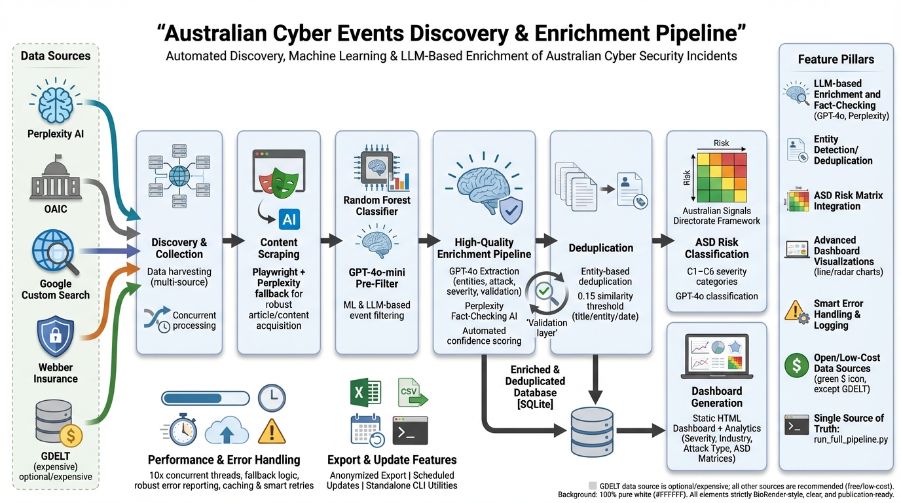

# Australian Cyber Events Discovery and Enrichment Pipeline

A Python pipeline for discovering, scraping, filtering, and enriching Australian cyber security events from multiple data sources using machine learning and LLM-based analysis.



---

## Quick Start — 3 Commands

All scripts must be run from the **project root directory**.

```bash
# Check status (last ingest + latest event in database)
python pipeline.py status

# Rolling 90-day refresh — recommended for monthly updates
python pipeline.py refresh

# Full pipeline with advanced options
python run_full_pipeline.py [options]
```

That's it for day-to-day use. Everything else is optional.

---

## Installation

```bash
git clone https://github.com/colinpriest/australian-cyber-events-scraper.git
cd australian-cyber-events-scraper

pip install -r requirements.txt

# For OAIC Power BI dashboard scraping (optional):
playwright install chromium

# Configure API keys
cp .env.example .env
# Edit .env with your keys
```

---

## Environment Variables

Create a `.env` file:

```env
# Required
OPENAI_API_KEY=your_openai_api_key

# Recommended (for event discovery)
PERPLEXITY_API_KEY=your_perplexity_api_key

# Optional (for Google Search source)
GOOGLE_CUSTOMSEARCH_API_KEY=your_google_api_key
GOOGLE_CUSTOMSEARCH_CX_KEY=your_cx_key

# Optional (GDELT only — WARNING: expensive BigQuery fees)
# GOOGLE_CLOUD_PROJECT=your_project_id
# GOOGLE_APPLICATION_CREDENTIALS=path/to/service-account.json

# Database
DATABASE_URL=sqlite:///instance/cyber_events.db

# Processing
MAX_THREADS=10
BATCH_SIZE=20
```

---

## pipeline.py — Simplified CLI

```bash
python pipeline.py refresh          # Rolling 90-day refresh (recommended)
python pipeline.py status           # Show last ingest and latest event
python pipeline.py rebuild --force  # Wipe and fully rebuild (destructive)
```

---

## run_full_pipeline.py — Advanced Control

The unified 5-phase pipeline: Discovery → Perplexity Enrichment → Deduplication → ASD Classification → Dashboard.

```bash
# Full pipeline (all phases)
python run_full_pipeline.py

# Discovery only (auto-enriches with Perplexity)
python run_full_pipeline.py --discover-only

# Re-enrich existing events
python run_full_pipeline.py --re-enrich [--re-enrich-limit N]

# ASD Risk Classification only
python run_full_pipeline.py --classify-only [--classify-limit N]

# Dashboard only (data already collected)
python run_full_pipeline.py --dashboard-only

# Specific sources, limits, date window
python run_full_pipeline.py --source Perplexity OAIC GoogleSearch WebberInsurance --days 30 --max-events 500

# Skip classification (faster)
python run_full_pipeline.py --skip-classification
```

### Options

| Option | Description | Default |
|--------|-------------|---------|
| `--discover-only` | Discovery phase only | False |
| `--dashboard-only` | Dashboard generation only | False |
| `--classify-only` | ASD classification only | False |
| `--re-enrich` | Re-enrich existing events | False |
| `--re-enrich-limit N` | Limit re-enrichment count | No limit |
| `--skip-classification` | Skip ASD classification | False |
| `--classify-limit N` | Limit classification count | No limit |
| `--force-dedup` | Force full deduplication rebuild (skip incremental mode) | False |
| `--skip-recurrence-check` | Skip re-checking short-gap repeat attacks | False |
| `--recurrence-window N` | Gap in days below which a repeat is re-checked | 90 |
| `--recurrence-min-certainty F` | Certainty required to merge a suspected re-report | 0.85 |
| `--skip-entity-sizing` | Skip estimating size bands for new entities | False |
| `--entity-size-limit N` | Cap entities sized per run | No limit |
| `--continue-on-error` | Continue if a phase fails | False |
| `--source SOURCE [SOURCE ...]` | Data sources to use | All |
| `--max-events N` | Max events per source per month | 1000 |
| `--days N` | Lookback window in days (0 = full history) | 0 |
| `--out-dir DIR` | Dashboard output directory | dashboard |
| `--db-path PATH` | Database file path | instance/cyber_events.db |

---

## Pipeline Phases

```
[Data Sources] → [Discovery & Scraping] → [Perplexity Enrichment]
                                                     |
                         [ML Filtering]     [Global Deduplication]
                                 |                   |
                                 └────────┬───────────┘
                                          ↓
                               [ASD Risk Classification]
                                          ↓
                               [Dashboard Generation]
```

1. **Discovery** — Collects events from Perplexity, OAIC, Google Search, Webber Insurance, GDELT. Scrapes full content. Runs GPT-4o-mini and Random Forest filtering.
2. **Perplexity Enrichment** — Extracts formal entity names, threat actors, attack methods via multi-source verification.
3. **Global Deduplication** — Entity-based matching: same entity + same date, or same entity + similar titles (0.15 threshold). Uses earliest date for merged events.
4. **ASD Risk Classification** — Assigns C1–C6 severity categories using the Australian Signals Directorate risk matrix. Incremental (skips already-classified events).
5. **Dashboard Generation** — Static HTML dashboard with Chart.js visualizations and ASD risk matrices for all years.

---

## Data Sources

| Source | Cost | API Key |
|--------|------|---------|
| Perplexity AI | ~$0.005/query | `PERPLEXITY_API_KEY` |
| OAIC | Free | None |
| Google Custom Search | Free (100 queries/day) | `GOOGLE_CUSTOMSEARCH_API_KEY` + `CX_KEY` |
| Webber Insurance | Free (scraping) | None |
| GDELT | **WARNING: $500–$2000+** | Google Cloud + BigQuery |

> Do not enable GDELT unless you have a BigQuery budget. Use `--source Perplexity OAIC GoogleSearch WebberInsurance` to exclude it.

---

## Project Structure

```
australian-cyber-events-scraper/
├── pipeline.py                    # Simplified CLI entry point (refresh/status/rebuild)
├── run_full_pipeline.py           # Advanced 5-phase pipeline entry point
├── requirements.txt
│
├── cyber_data_collector/          # Core package
│   ├── datasources/               # Perplexity, OAIC, Google Search, Webber, GDELT
│   ├── enrichment/                # High-quality 5-stage enrichment pipeline
│   ├── filtering/
│   │   ├── rf_event_filter.py     # Random Forest ML filter
│   │   ├── progressive_filter.py
│   │   └── confidence_filter.py
│   ├── models/                    # CyberEvent, EventSeverity, CyberEventType
│   ├── pipelines/
│   │   └── discovery.py           # Discovery and initial processing pipeline
│   ├── processing/                # LLM classification, deduplication, enrichment
│   ├── storage/
│   │   ├── cyber_event_data_v2.py # Thread-safe SQLite database operations
│   │   ├── database.py
│   │   └── deduplication_storage.py
│   ├── utils/
│   │   ├── entity_scraper.py      # Playwright-based web scraping
│   │   ├── llm_extractor.py       # GPT-4o-mini event extraction
│   │   └── ...
│   └── tests/
│
├── scripts/                       # Utility scripts (run from project root)
│   ├── asd_risk_classifier.py     # Standalone ASD risk classification
│   ├── build_static_dashboard.py  # HTML dashboard generation
│   ├── analyze_recurrent_timing.py # Repeat-event survival/recurrent timing analysis
│   ├── perplexity_backfill_events.py  # Backfill Perplexity enrichment
│   ├── project_status.py          # Pipeline status reporter
│   ├── run_global_deduplication.py    # Standalone deduplication runner
│   ├── wipe_database.py           # Database reset utility
│   ├── oaic/
│   │   ├── oaic_data_scraper.py       # OAIC PDF report scraper (<= 2024 H2)
│   │   ├── OAIC_dashboard_scraper.py  # OAIC Power BI dashboard scraper (<= 2025 H1)
│   │   ├── oaic_datagov_scraper.py    # OAIC data.gov.au XLSX ingester (2025 H2 onward)
│   │   └── cleanup_oaic_data.py       # OAIC data validation
│   ├── export/
│   │   ├── export_events_excel.py     # Export to Excel with LLM summaries
│   │   └── export_cyber_events.py     # Full database export (CSV/Excel)
│   └── setup/
│       └── setup_bigquery_auth.py     # BigQuery authentication setup
│
├── docs/                          # Detailed pipeline stage documentation
├── analysis/                      # Generated statistical analysis reports
├── machine_learning_filter/       # Trained Random Forest model artifacts
├── instance/                      # SQLite database (gitignored)
├── logs/                          # Log files (unified_pipeline.log, etc.)
├── dashboard/                     # Generated HTML dashboard (gitignored)
└── risk_matrix/                   # Generated ASD risk matrix Excel files
```

---

## Utility Scripts

All utility scripts are in `scripts/` and must be run from the project root.

### ASD Risk Classifier

```bash
python scripts/asd_risk_classifier.py                     # Classify all unclassified events
python scripts/asd_risk_classifier.py --limit 50          # Limit to 50 events
python scripts/asd_risk_classifier.py --force-reclassify  # Re-classify all events
python scripts/asd_risk_classifier.py --output-dir my_matrices
```

### Global Deduplication

```bash
python scripts/run_global_deduplication.py             # Incremental deduplication (new events only)
python scripts/run_global_deduplication.py --force      # Full rebuild (reprocess all events)
python scripts/run_global_deduplication.py --dry-run   # Preview without changes
python scripts/run_global_deduplication.py --verbose    # Enable verbose logging
```

> **Note on the incremental-mode warning.** `run_full_pipeline.py` warns when
> dedup output is under 10% of input. In incremental mode `output_events`
> counts only *newly created* dedup rows — events that merge into existing rows
> are counted separately — so a low ratio is normal and not evidence of
> over-merging. Check `merged into existing` in the log before acting on it.

### Deduplication v3 — audit, review and correction

Entity-aware, LLM-adjudicated deduplication with a full audit trail, reversible
merges, and human overrides that survive rebuilds. Full design:
[docs/09-deduplication-v3.md](docs/09-deduplication-v3.md).

```bash
python scripts/dedup_admin.py migrate                       # idempotent schema
python scripts/dedup_admin.py backfill --dry-run            # repair lineage + provenance
python scripts/dedup_admin.py backfill

python scripts/dedup_admin.py find-missed --no-llm          # free candidate preview
python scripts/dedup_admin.py find-missed                   # adjudicate (embeddings + GPT-4o)
python scripts/dedup_admin.py apply-missed --min-certainty 0.9

python scripts/dedup_admin.py override <enr_a> <enr_b> different --reason "..."
python scripts/dedup_admin.py split <dedup_id> <enriched_id> --reason "..."
python scripts/dedup_admin.py learn                         # fold corrections back in
python scripts/dedup_admin.py ancestry <dedup_id>           # provenance tree as JSON
```

Every merge records who decided, how certain, by what method, the reasoning and
the evidence. Splits and merges run against stored state — **no re-scraping or
pipeline rerun** — and each mutation snapshots the previous state for restore.
Overrides are keyed on `enriched_event_id` pairs (stable) rather than
`deduplicated_event_id` (regenerated every rebuild), so corrections persist.

### Cluster-level adjudication

Pairwise comparison cannot see a cluster. When one breach generates a long tail
of coverage (incident report, regulator statement, class action, "government
concludes response"), each article emphasises something different, so pair by
pair an LLM keeps answering "different incident" - consistently, so re-checking
pairs does not help. HWL Ebsworth fragmented into 19 separate events.

`adjudicate-clusters` shows the model every record in a cluster at once and
asks for a **partition**, which is internally consistent by construction and
costs one call per cluster instead of N(N-1)/2.

```bash
python scripts/dedup_admin.py adjudicate-clusters --dry-run
python scripts/dedup_admin.py adjudicate-clusters --entity "Ebsworth"
python scripts/dedup_admin.py adjudicate-clusters --min-certainty 0.8
```

Nothing is applied unless the partition covers every record exactly once;
invalid partitions, LLM failures and oversized clusters all degrade to
"change nothing". See [docs/09-deduplication-v3.md](docs/09-deduplication-v3.md).

### Repeat attacks inside 90 days, re-checked

An organisation attacked again a few weeks after the last time is the shape a
*reporting lag* produces, not usually a second attack. The follow-up article,
the regulator's notification and the class action all describe the first breach
but carry their own publication dates; where the extraction takes the
publication date as the incident date, one breach becomes two events dated
weeks apart.

Short gaps are where this is both most likely (reporting lag is measured in
weeks) and most damaging: the short-elapsed-time band is what
`analyze_recurrent_timing.py` estimates its recurrence hazard from, so a false
duplicate there does not add noise — it manufactures the signal.

```bash
python scripts/dedup_admin.py check-recurrences --dry-run --verbose
python scripts/dedup_admin.py check-recurrences                  # apply
python scripts/dedup_admin.py check-recurrences --window-days 120
python scripts/dedup_admin.py check-recurrences --entity "Optus"
```

Neither existing pass covers this: `consolidate` needs the *same date*, and
`adjudicate-clusters` only compares what its blocking put in one cluster. Each
organisation's events are chained while every consecutive gap is under the
window and the whole **run** is partitioned in one call, so the verdicts cannot
contradict each other the way N pairwise answers can.

Merging two genuinely separate incidents is the worse error, so the adjudicator
is shown the distinguishing evidence explicitly (attack method, record count,
source URLs, the gap in days), merges only at or above `--min-certainty`
(default 0.85), and is vetoed outright by an existing human `different`
override. On the live database this found 8 short-gap runs, merged 3 false
repeats (MIFF, Swinburne, Notre Dame) and left the genuine ones alone —
including Optus's September and December 2022 events, 86 days apart. Findings
are written to `instance/recurrence_findings.json`; the check runs
automatically after every deduplication (`--skip-recurrence-check` to opt out).

### Entity size: SMALL, MEDIUM, LARGE, HUGE, UNKNOWN

`EntitiesV2.employee_count` and `turnover` have existed since v1 and were NULL
on **every one of 3,133 rows**, so any analysis asking how big the victim was
ran with one "unknown" level for the whole dataset. An exact headcount is
unobtainable for most of these organisations; the band is not.

| Band | Definition |
|---|---|
| `SMALL` | fewer than 20 employees, or under A$10m revenue |
| `MEDIUM` | 20–199 employees, or A$10m–100m |
| `LARGE` | 200–4,999 employees, or A$100m–1b |
| `HUGE` | 5,000+ employees or over A$1b; also national/state departments, the major universities, ASX-100 |
| `UNKNOWN` | not identifiable, or not an organisation at all |

The three-way cut is the **ABS definition of business size** (small 0–19,
medium 20–199, large 200+); `LARGE` is split at 5,000 because that band
otherwise runs from a mid-sized firm to Telstra.

```bash
python scripts/dedup_admin.py size-entities --dry-run --verbose
python scripts/dedup_admin.py size-entities                  # backfill
python scripts/dedup_admin.py size-entities --entity "Optus" --refresh
```

Perplexity looks each organisation up online — website, annual report,
LinkedIn, ABN/ASIC, news — and the band is derived from what it finds, with the
citations kept in `size_sources` so an estimate can be traced back to its
evidence. Asking an LLM from memory instead would confidently size the many
small Australian businesses it has never heard of. Where the answer reports a
figure and a band that disagree ("about 45,000 staff … LARGE"), the figure
decides.

`UNKNOWN` is an answer, not a failure: a product, a person, a ransomware group
and a collective noun ("Australian hospitals") have no organisational size, and
those are settled by rule at no API cost — about 44% of the table. A row whose
research could not be *reached* is marked `unavailable` and retried next run, so
an outage never hardens into a settled UNKNOWN. A `human` method is never
overwritten. Incremental by default, and run automatically after each
deduplication (`--skip-entity-sizing` to opt out).

### Other deduplication repair commands

```bash
# Rule 1: same entity + same date is one incident (deterministic, no LLM)
python scripts/dedup_admin.py consolidate --dry-run
python scripts/dedup_admin.py consolidate --date-tolerance 3

# Give borderline (0.80-0.89) findings a final disposition
python scripts/dedup_admin.py resolve-band --dry-run

# Re-examine splits that separated records about the same organisation
python scripts/dedup_admin.py recheck-splits --dry-run
```

### Records-affected sanity repair

Global vendor breaches get their worldwide total attributed to the Australian
customer caught up in them - the University of Melbourne (~50,000 students) was
recorded as losing 275,000,000 records, the global Canvas/Instructure figure,
because validation inferred the organisation from the event *title* (which
named the vendor) rather than the victim field.

```bash
python scripts/fix_records_affected.py --dry-run
python scripts/fix_records_affected.py
```

Validation is now victim-aware in both directions: an Australian-only
organisation is capped at the national population, while a genuinely global
victim (Dell, Ticketmaster) keeps its real figure. Only over-statements are
corrected - small counts are often exactly right ("6 senators confirm being
targeted").

### Entity typing: victim, vendor, and what each entity is

Counting mentions cannot tell the breached company apart from the software it
was breached through, which is how the global Canvas incident came to be
attributed to "Canvas Learning Management System" - a product. Every entity
link carried `relationship_type='affected'`, so the column said nothing.

Two levels are now recorded, because they vary independently:

| | Scope | Stored on | Values |
|---|---|---|---|
| **Kind** | Invariant | `EntitiesV2.entity_kind` | organisation, government_body, product, person, threat_actor, other |
| **Role** | Per event | `EnrichedEventEntities.relationship_type` | victim, vendor, affected_customer, regulator, threat_actor, product, bystander |

Victim remains the primary output; the vendor is recorded alongside it in
`DeduplicatedEvents.vendor_organization_name`, because a supply-chain breach is
only intelligible when both are known.

```bash
python scripts/dedup_admin.py classify-entities --dry-run
python scripts/dedup_admin.py classify-entities --entity "Canvas" --show-roles
python scripts/dedup_admin.py classify-entities
```

A role-labelled victim outranks the frequency heuristic. A product can never be
returned as the victim, invented entities are discarded, and on LLM failure the
rules apply - which never invent a victim.

Roles depend on which records an event contains, so a merge or split
invalidates them. Each event stores a signature of the members it was
classified against, so any membership change - by any route - shows up
automatically; nothing has to remember to raise a flag.

```bash
python scripts/dedup_admin.py roles-status                     # what needs refreshing
python scripts/dedup_admin.py classify-entities --stale-only   # refresh only those
python scripts/dedup_admin.py roles-status --invalidate-all    # after changing the classifier
```

Run `classify-entities --stale-only` after any merge pass (`apply-missed`,
`consolidate`, `adjudicate-clusters`). The dashboard shows a "roles stale"
badge and filter.

### Deduplication Review Dashboard

```bash
python scripts/build_dedup_dashboard.py                # -> dashboard/dedup.html
```

Per event: full ancestry (every source record, its role and outbound link), the
decisions behind it with certainty and reasoning, and copy-paste commands to
correct it. Filter by *merged but unexplained*, *certainty below 0.85*, *no
lineage*, or *human-corrected*.

### By-entity event dashboard

```bash
python scripts/build_entity_dashboard.py             # -> dashboard/entities.html
```

Every event listed under the organisation it happened to, sorted by entity then
event date, with entity / event / date / description columns. Sorting this way
makes under-deduplication visible: one incident still stored as several events
appears as consecutive rows under the same organisation, which is how the
Latitude, Medibank and Dymocks fragments were found. Tick **only entities with
more than one event** to hide every single-event organisation and leave just
those candidates.

Attribution comes from the `victim` role, not `victim_organization_name`, so an
event with several co-equal victims (the ProctorU breach has ten Australian
universities) is listed under each of them.

Each organisation carries its ordinal size band as a badge, with a filter in
the toolbar and the supporting evidence on hover — "what happens to small
businesses" is a different question from "what happens to the ASX-100", and the
page could not previously tell them apart. See
[Entity size](#entity-size-small-medium-large-huge-unknown).

### Entity canonicalisation, date repair and per-entity reconciliation

Three defects compounded into most of the missed merges, because deduplication
blocks candidate pairs on the entity and treats a date gap as evidence of
separate incidents. Anything blocking never produced, no adjudicator could
recover.

```bash
python scripts/dedup_admin.py canonicalise-entities --dry-run
python scripts/dedup_admin.py canonicalise-entities   # 413 names -> 200 organisations

python scripts/dedup_admin.py redate --dry-run
python scripts/dedup_admin.py redate                  # member consensus + text
python scripts/dedup_admin.py redate --research       # Perplexity + GPT-4o for the rest

python scripts/dedup_admin.py reconcile-entities --dry-run
python scripts/dedup_admin.py reconcile-entities
```

**Entity spellings.** "Australian Securities and Investment Commission" and
"Australian Securities and Investments Commission" were separate rows, so three
ASIC events with byte-identical titles, dates and descriptions were never even
compared. Names that only a human would know are equivalent ("Australia" for
the Commonwealth, "CommBank"/"Commonwealth Bank") are listed in
`EXPLICIT_ALIASES`; every fold is remembered in `EntityAliases` so a future
ingest resolves the variant instead of recreating it.

**Dates.** Merging took the *earliest* member date, so one bad extraction
captured the event: MediSecure has 77 source records, 64 saying April 2024, and
was stored as **March 2019** - which then convinced the cluster adjudicator that
its fragments were separate incidents. The modal month now wins, using the
earliest date within it. Overruling a stored date needs real agreement and is
refused when the title asserts its own date, so "Optus White Pages breach
(2019)" is not dragged to 2022 by coverage of the larger 2022 Optus breach.
Blank dates are recovered from the description, then by search.

**Reconciliation.** `reconcile-entities` ignores blocking entirely: it groups
every active event by the `victim` **role** finally attributed to it and asks
one LLM call per organisation whether those events are one incident. This is
the follow-up pass - it catches what blocking missed, including the many events
with no scalar victim that the cluster pass skipped.

### Dashboard

```bash
python scripts/build_static_dashboard.py               # Generate dashboard/index.html
```

### Database

```bash
python scripts/wipe_database.py                        # Reset entire database
```

### Data Integrity Checker

End-to-end sanity check that detects every failure mode encountered to date
(truncated severity strings, qualified `EventSeverity.X` enum names,
ASD-classification orphans, byte-identical OAIC H1/H2 records, top_sectors
notification counts outside a sensible range, etc.). Returns exit code 1 if
any check fails, so it doubles as a CI gate.

```bash
python scripts/check_data_integrity.py                 # Full report
python scripts/check_data_integrity.py --quiet         # Only show failures
python scripts/check_data_integrity.py --db PATH       # Override DB path
```

### Repeat-event timing analysis

`scripts/analyze_recurrent_timing.py` tests whether repeat cyber-event timing
for victim entities is consistent with a memoryless process, or whether risk
changes with time since the prior event.

The analysis is conditional on an entity having at least one observed victim
event. Single-event entities contribute right-censored post-event spells. The
primary model is a piecewise exponential recurrent-event model over elapsed
time since the prior event. The adjusted model controls for calendar period,
prior event number, ordinal organisation size (`SMALL`, `MEDIUM`, `LARGE`,
`HUGE`, with `UNKNOWN` handled separately), sector proxy, entity kind and
records-affected band.

```bash
# Main report with broad elapsed-time bands
python scripts/analyze_recurrent_timing.py --bootstrap 500

# Formal delayed-peak sensitivity: 0-90, 91-180, then later bands
python scripts/analyze_recurrent_timing.py \
  --elapsed-bounds 0,90,180,365,730,1460,inf \
  --out-dir analysis/recurrent_timing_90_180_peak \
  --bootstrap 500
```

Main outputs are written under `analysis/recurrent_timing/`:

| File | Purpose |
|---|---|
| `recurrent_timing_report.md` | Human-readable report and interpretation |
| `analysis_summary.json` | Machine-readable summary of model results |
| `piecewise_elapsed_hazard.csv` | Unadjusted elapsed-time rates by band |
| `adjusted_piecewise_coefficients.csv` | Adjusted model coefficients and rate ratios |
| `u_shape_adjusted_contrasts.csv` | U-shape phase contrasts |
| `u_shape_covariate_variant_contrasts.csv` | Sensitivity checks dropping size and/or sector |
| `delayed_peak_sensitivity_adjusted_contrasts.csv` | Formal 91-180 day delayed-peak contrasts |
| `piecewise_hazard.png`, `survival_curve.png`, `parametric_hazards.png` | Diagnostic plots |

Current headline result from the cleaned/deduplicated database:

- The broad `0-180 / 181-365 / 366-730 / 731-1460 / >1460` adjusted model does
  not reject constant elapsed-time risk (`p = 0.1527`).
- A sensitivity model that splits the first six months into `0-90` and
  `91-180` does reject constant elapsed-time risk after adjustment
  (`p = 0.0321`).
- The strongest feature is a delayed early peak: the `91-180` day window has an
  adjusted repeat-event rate about `2.91x` the first `0-90` days
  (`95% CI 1.13-7.50`, directional `p = 0.014`).
- The `91-180` day window is also estimated at about `1.53x` the pooled
  post-180 period, but that comparison is weaker (`95% CI 0.86-2.70`,
  directional `p = 0.073`).
- The explanatory story - immediate lockdown/high alert, attackers returning,
  incomplete remediation, later training and eventual complacency - is
  plausible data storytelling, not proven mechanism. The analysis tests timing
  patterns, not causality.

### Safety Vault (snapshot/restore around destructive operations)

`run_global_deduplication.py --force` automatically snapshots ASD
classifications and industry overrides before rebuilding `DeduplicatedEvents`,
then restores them via the stable `master_enriched_event_id` after the rebuild.
Snapshots are written to `instance/safety_vault/`. No manual action required;
a force-dedup is now safe to re-run without losing session-level corrections.

The vault module: [`cyber_data_collector/utils/safety_vault.py`](cyber_data_collector/utils/safety_vault.py).
Tests: [`cyber_data_collector/tests/test_safety_net.py`](cyber_data_collector/tests/test_safety_net.py).

### OAIC Data Collection

OAIC (Office of the Australian Information Commissioner) publishes semi-annual Notifiable Data Breaches reports. Update when new reports are released (H1: August/September, H2: February/March).

The OAIC dashboard scraper extracts these fields per semester (page 2-9):

| Field | Source page | Notes |
|---|---|---|
| `total_notifications` | 2 | Big KPI |
| `monthly_notifications` | 2 | One bar per month |
| `human_error_pct` / `malicious_attacks_pct` / `system_faults_pct` | 2 | Donut |
| `cyber_incidents` (phishing/ransomware/etc. %) | 2 | Bar chart |
| `top_sectors[].notifications` | 2 | Top-5 sectors with COUNTS |
| `small_breaches_100_or_fewer_pct` | 2 | KPI |
| `human_error_causes` | 2 | Top-3 causes |
| `individuals_affected_distribution` | 4 | 13 buckets, real OAIC labels |
| `large_scale_australians` | 4 | Right-side table |
| `personal_info_types` | 5 | Contact / Identity / Financial / Health / TFN / Other / CDR / Digital ID |
| `breach_sources` | 6 | Human / Malicious / System current+previous |
| `time_to_identify_pct` | 7 | 5 buckets `Unknown` / `<= 10 days` / `11-20 days` / `21-30 days` / `> 30 days` |
| `time_to_notify_pct` | 8 | Same 5 buckets |
| `sector_by_source` | 9 | 5×3 matrix (still WIP - filter-click bug) |

Every per-page extraction is verified against the dashboard's own
"Show results for ..." semester label so silent semester-selection failures
can't mislabel data.

```bash
# Scrape statistics from OAIC PDF reports (older mechanism, less detailed)
python scripts/oaic/oaic_data_scraper.py --start-year 2024 --end-year 2025 --output json

# Scrape OAIC Power BI dashboard (Playwright + GPT-4o Vision).
# All 7 most recent semesters in parallel under 4 minutes:
python scripts/oaic/OAIC_dashboard_scraper.py --from-year 2022
python scripts/oaic/OAIC_dashboard_scraper.py --semester "Jan-Jun 2025"

# Ingest OAIC statistics published on data.gov.au (2025 H2 onward - see below)
python scripts/oaic/oaic_datagov_scraper.py --existing-data oaic_cyber_statistics_<latest>.json

# Validate and consolidate OAIC data (run after scraping)
python scripts/oaic/cleanup_oaic_data.py
```

#### Where each OAIC period comes from

OAIC has changed publication channel twice, and **each channel stopped being
updated rather than being backfilled**, so all three scrapers remain necessary:

| Periods | Channel | Script |
|---|---|---|
| up to 2024 H2 | PDF reports on the OAIC publications page | `oaic_data_scraper.py` |
| up to 2025 H1 | Power BI statistics dashboard | `OAIC_dashboard_scraper.py` |
| 2025 H2 onward | XLSX resource on data.gov.au | `oaic_datagov_scraper.py` |

As of August 2026 the Power BI dashboard still states "Updates to this
dashboard are forthcoming and will include data for July-December 2025 and
January-June 2026", so the dashboard scraper alone will silently report
"no new data" even when a new period has been published. The data.gov.au
ingester discovers resources through the CKAN API rather than hard-coded
URLs, so a future Jan-Jun 2026 release is picked up without a code change.

Two caveats on data.gov.au periods:

- The per-method cyber-incident split (phishing / ransomware / hacking /
  brute force / malware / compromised credentials) is **not published** there
  and is stored as `null`, not zero. Those dashboard series have a genuine gap
  from 2025 H2.
- `cyber_incidents_total` is set to the malicious-or-criminal-attack count to
  match how every dashboard-scraped period from 2023 H1 onward populates it.
  OAIC's narrower "Cyber incident" sub-source is preserved separately as
  `cyber_incident_only` (253 for 2025 H2, against 405 malicious attacks).

### Export

```bash
# Clean 7-column Excel export with LLM summaries and anonymization
python scripts/export/export_events_excel.py
python scripts/export/export_events_excel.py --exclude-unknown-records --limit 100

# Full database export (all columns)
python scripts/export/export_cyber_events.py --format csv --output events.csv --detailed
python scripts/export/export_cyber_events.py --format excel --output events.xlsx --detailed --anonymize
```

### Setup

```bash
# BigQuery authentication (GDELT only — expensive)
python scripts/setup/setup_bigquery_auth.py
```

---

## Database Schema

### Core Tables

| Table | Description |
|-------|-------------|
| `RawEvents` | Discovered events before processing |
| `EnrichedEvents` | LLM-processed events with metadata |
| `DeduplicatedEvents` | Final unique events after merging |
| `ASDRiskClassifications` | ASD C1–C6 risk matrix assignments |
| `EntitiesV2` | Organizations and entities mentioned, with `entity_kind` and the ordinal `size_estimate` |
| `EnrichmentAuditTrail` | Full audit trail for all enrichment stages |

---

## Monthly Update Guide

### Standard Monthly Refresh (Recommended)

```bash
python pipeline.py refresh
```

### Comprehensive Monthly Update

```bash
python run_full_pipeline.py --source Perplexity OAIC GoogleSearch WebberInsurance --days 30 --max-events 500
```

### Full Rebuild (Rare)

```bash
python pipeline.py rebuild --force
```

### Scheduled Task (Windows Task Scheduler)

```
python d:\dev\australian-cyber-events-scraper\run_full_pipeline.py --source Perplexity OAIC GoogleSearch WebberInsurance --days 30 --max-events 500
```

### Cron Job (Linux/Mac, first Monday of each month)

```cron
0 2 1-7 * 1 cd /path/to/australian-cyber-events-scraper && python run_full_pipeline.py --source Perplexity OAIC GoogleSearch WebberInsurance --days 30 --max-events 500
```

---

## Development

```bash
pytest                              # Run all tests
pytest cyber_data_collector/tests/  # Run specific module
pytest --cov=cyber_data_collector   # With coverage report
```

---

## Troubleshooting

| Problem | Solution |
|---------|----------|
| LLM API rate limits | Reduce `MAX_THREADS` in `.env` |
| Database lock errors | Ensure only one pipeline instance runs at a time |
| Scraping failures | Check Playwright installation: `playwright install chromium` |
| BigQuery auth errors | Run `python scripts/setup/setup_bigquery_auth.py` |
| Memory issues | Reduce `BATCH_SIZE` in `.env` or process smaller date ranges |

Check `logs/unified_pipeline.log` for detailed processing information.

---

## Documentation

Detailed specifications for each pipeline stage are in the `docs/` directory:

| Document | Description |
|----------|-------------|
| [01-data-sources.md](docs/01-data-sources.md) | Data source descriptions, API configurations, and justifications |
| [02-discovery-collection.md](docs/02-discovery-collection.md) | Discovery pipeline, search queries, and LLM prompts |
| [03-content-scraping.md](docs/03-content-scraping.md) | Playwright scraping, content extraction, and fallback strategies |
| [04-event-filtering.md](docs/04-event-filtering.md) | Random Forest ML filter, confidence scoring, and LLM classification |
| [05-event-enrichment.md](docs/05-event-enrichment.md) | 5-stage enrichment pipeline with Perplexity and GPT-4o |
| [06-deduplication.md](docs/06-deduplication.md) | Entity-based deduplication, similarity matching, and merge logic |
| [07-ASD-risk-classification.md](docs/07-ASD-risk-classification.md) | ASD risk matrix framework and GPT-4o classification |
| [08-dashboard-generation.md](docs/08-dashboard-generation.md) | Dashboard SQL queries, Chart.js charts, and OAIC comparison |
| [data-dictionary.md](docs/data-dictionary.md) | Complete database schema, table definitions, and field descriptions |

These documents contain sufficient detail for independent review and replication of each pipeline stage.

---

**Built for Australian cyber security research and monitoring.**
